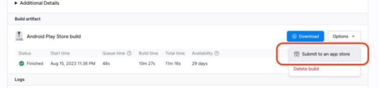

# 311 Customer Service Mobile (Android/IOS)
![headerImage]

---
## Synopsis
**City of Sacramento's 311 mobile service** developed on React Native using the Expo framework. This repository pertains to the Senior Project for team **Stack 8** in accordance with courses **CSC 190 and CSC 191** at *California State University, Sacramento* (Fall 2023 - Spring 2024).

[City of Sacramento's 311 Customer Services][link] include non-emergency telephone and web services which receive thousands of **non-emergency service requests** everyday from city residents, visitors, and businesses in accordance to existing addresses within the county. The legacy 311 mobile app employs City of Sacramento's 311 responsive web page embedded into a mobile view. This project aims to **migrate the existing services** to a single code base for centralized deployments to **both AndroidOS and IOS.**

To achieve this, the project leverages the **React Native** framework, a popular open-source framework that enables efficient **development of cross-platform mobile applications using JavaScript and React.** The massive number of requests the project must handle and the need for accordance with valid addresses calls for the employment of several geolocation and geocoding services through the **Google Maps API,** a set of programming interfaces that enables developers to embed maps and find addresses, among other location-related functionalities. The app will integrate with City of Sacramento's existing **Salesforce** instance, a **cloud-based customer relationship management (CRM) platform** that offers a suite of tools and services to help manage customer service operations and data, effectively serving as the database for this project. Lastly, for the ease of development and deployment the project utilizes **Expo,** a framework built on top of React Native that provides a set of libraries and tools allowing developers to create and deploy mobile apps for **IOS and Android** without the need for extensive native code. 

---
## Team Stack 8
**Stack 8** consists of nine computer science majors in our final year of studies. We possess a solid foundation in various programming languages and software paradigms. As a team, we share a **commitment to teamwork, adaptability, and problem-solving.** Stack 8 includes the following members:

- Ranjot Dharni
- Brennan Moran
- Sean Russel Agarrado
- Jeffrey Bianucci
- Nicolas Baturin
- Connor Dominik
- David Chernyy
- Jalen Scrivner
- Jeremy Smart

---
## Deliverables Report
The overarching project flow is organized into one academic year split across **two periods, each consisting of 4 sprints,** totaling an **8 sprint run**. The first 4 sprints span the length of Fall 2023, and the last 4 throughout Spring 2024. Below are screenshots of some of the **latest iterations of the front-end implemenation** using React Native and Google Maps on the Expo framework:

Splash Screen              |  Home Screen              |  Map Screen               |  New Request Screen
:-------------------------:|:-------------------------:|:-------------------------:|:-------------------------:
![splashImage]             | ![homeImage]              | ![mapImage]               |  ![selectImage]

---
## Salesforce Integration
**Salesforce CRM** provides an expansive list of **built-in, standard objects** for storing data within an instance. However, for flexibility considerations, Salesforce **allows users to define and store custom objects as well** for storing data in a specified format. City of Sacramento's existing Salesforce instance employs a combination of custom and standard Salesforce objects, the relational mapping for which consists of a complex web of connections. This would be difficult to represent diagrammatically in its entirety, however for the purposes of demonstration, we can use the Salesforce standard objects to design a potential **Entity Relationship Diagram (ERD)** that represent a subset of services, such as our **311 mobile app service.** This ERD may look something like the following:

![ERD]

<span style="font-size: 0.75rem">*This mock-up is a precursor representation and is subject to change based on new requirements or data*</span>

---
## Milestone Timeline**
- [X] <span style="font-size: 1.25rem">**Resources Section**</span>
    1. Implement **consistent, scalable design** for loading and displaying a constantly updated **list of user resources**
    1. Create **centralized view** for users to find and read articles, statements, or documents related to City of Sacramento's non-emergency services
    1. Allow users to **search, sort, or filter resource data** to find a specific article, statement, or document
    1. Integrate front-end with City of Sacramento's existing **AWS Elastic Search** instance to enable users to find specific resources efficiently

- [X] <span style="font-size: 1.25rem">**Google Maps API**</span>
    1. Flesh out interactivity of the current **embedded map**
    1. Allow users to **search, sort, or filter location data** to find a specific address
    1. Integrate map view with **exisiting, geocoded requests** in City of Sacramento's database instance

- [X] <span style="font-size: 1.25rem">**SalesForce Integration**</span>
    1. Integrate **existing service request data** from City of Sacramento's database instance
    1. Configure front-end to **transform requests to the proper format** for storage

- [ ] <span style="font-size: 1.25rem">**Authentication**</span>
    1. Enable user profile creation and login-in
    1. Configure **Azure B2C** authentication protocol
    1. Integrate authentication with **existing user profile data**

- [ ] <span style="font-size: 1.25rem">**Modifiable Request Formats**</span>
    1. Enable City of Sacramento to **modify format** of incoming requests **without the need for app redeployment**
    1. Leverage Salesforce object for storing format of a request, then modify this object on update to request format
    1. Engage in **constant, consistent communication** with City of Sacramento's back-end team to **ensure proper allocation of the resources required** to implement this feature

<span style="font-size: 0.75rem">**CSC 191*</span>
<span style="font-size: 0.75rem">***Based on summary of JIRA backlog*</span>

---
## Testing

Testing was conducted by the Stack 8 team to provide evidence of the current working status of notable features. These features at a minimum represent all features that were specified in the product charter. Many functionalities were added at the request of the client and project owner, and also by the Stack 8 team further down the development timeline. In the following section, you will find instructions on how to run the test suite on your own machine. If a feature behaves in an unintentional way, it is also documented as a failed test (although the most recent finalization of this project which this section references ensures that all of the most recent tests pass). Each test is created and conducted by a recorded member of the Stack 8 team. Every test in the suite for this project is only valid and reproducible when conducted on the exact system configuration as dictated in this section. Test artifacts can be found on the **rn_testing** branch of this repository under */src/tests*.

### Test Environment

For our specific development purposes, the following testing environment was used:

1. **Operating System:** *Windows 11*
1. **NodeJS Version:** *v20.9.0*
1. **Node Package Manager Version:** *v10.1.0*

You may use your own testing environment, however, your existing set up may interfere with or potentially break the underlying test implementations if incorrectly configured.

### Running A Test

You can run the tests in the test suite in a group or individually. To demonstrate, we will use the *Resources.test.js* file found in the suite. Clone the repository from GitHub by using the following command: 

```
git clone https://github.com/ranjotdharni/sac-311-mobile
```

Switch to the testing branch of the repository:

```
git checkout rn_testing
```

Switch to the app folder:

```
cd src
```

Install the required packages:

```
npm install
```

Run all of the tests located in the tests folder by running the command:

```
npm test
```

To run a single test file, such as *Resources.test.js*, use this syntax:

```
npm test Resources.test.js
```

---
## Developer Instructions
The following section covers the various requirements and workflows surrounding development for this project. A basic development pattern is laid out and consistently observed throughout the codebase. The subsequent sections aim to exemplify this development paradigm by analyzing the structure of code and flow of tasks when making a new service request to the City of Sacramento, a primary functionality of the application.

### **Prerequisites**

To develop using the interface provided by the **Expo** framework, you must make sure that the **Expo Mobile Application** is downloaded on your target development device (physical or otherwise). This project in particular was developed in **Microsoft Visual Studio Code (MVSC)** using the **Node Package Manager (NPM)** to manage dependencies. Version control and integration pipelines were managed using **Git** and its corresponding child technologies **(GitHub, GitHub Desktop).** Choose the appropriate development flow that works best for your team(s) or process. The last deployed projected structure can be viewed here. Clone the project to your local directory:

```
git clone https://github.com/ranjotdharni/sac-311-mobile.git
```

Switch to the source directory:

```
cd src
```

Use NPM to install the necessary dependencies:

```
npm install
```

You have 4 primary options available to you initially (feel free to expand on this) to start the project development interface. In general, the default option will serve most of your development needs. Depending on the context, however, you may find use for the various other options which can be found in */src/package.json*. For demonstration purposes, we will use the default variant:

```
npm run start
```

If everything has gone well, you should be met with a QR code and a url prefixed with ‘exp://’. Once again, it is emphasized on your target physical device to ensure that the Expo app is downloaded from the **Google Play Store** or **App Store** on AndroidOS and iOS respectively. If possible, **scan the QR code and follow the prompts** to launch the Expo application on your device. If necessary, you may enter the provided URL (prefixed with ‘exp://’) into a browser on your device, upon which you will once again be prompted to launch the Expo application on

your device. For emulators, Expo will detect most AndroidOS and iOS emulators running on your host machine once the project finishes building and the development server launches on your host. Follow the necessary prompts to find similar results in your emulated device.

When the Expo application launches on your mobile/emulated device, you should find your splash screen (if not omitted) along with a message indicating the progress of JavaScript bundling. Let this complete and if everything has been done correctly, **you should be met with the Home screen:**

Bundling                   |  To                       |  Home                     
:-------------------------:|:-------------------------:|:-------------------------:
![bundlingImage]           | ![arrow]                  | ![homeScreenImage]

**Fig 1.1:** *Bundling to Home screen*

While your app is connected to the development server, any changes you make in the application source code in the IDE will be reflected upon saving them in the local files. Changes to the app’s primary source code can be effectuated by modifying the React components found in the /src/app directory.

### **Navigation**

Primary navigation between the major, functional screens in the app is effectuated through the **use of the imperative navigation bar,** almost always present at the bottom of the app (the exception being modal overlays).


**Fig 1.2:** *Navigation Bar on iOS*

Each button on the bar (either shaded-out in gray, or highlighted in yellow) corresponds to a **NavItem** component and the implementation shown above uses them to navigate to the 4 major screens on top of which the app is built. In the codebase, each *NavItem* (under */src/app/(components)*) component is embedded in the **NavBar** parent component that makes up the entirety of the navigation bar above. *NavItem* components offer an additive implementation of navigation to major screens in the application and can be customized for each item present in the navigation bar.

The exception to these buttons is the central, blue button on the navigation bar. This button can be used to create a new service request (the primary functionality of the app) and will take over the in-app screen using a modal overlay view. The screens found in the new request modal flow are detailed enough to warrant their own sections and will be discussed more in-depth later in this manual. However, first we can take a short look at the purposes of the *NavBar* (also under */src/app/(components)*) component.

### **Navigation Bar**

The navigation bar is a component composed of inner, embedded and named components. The parent component is in charge of orchestrating the underlying functionality. Each **NavItem** is displayed according to the environment created in the parent navigation bar, and this parent is responsible for launching a new request interface when the center button is pressed (such as by passing an empty parameter of the correct type to the resulting new request modal). Lastly, the navigation bar implementation at the time of writing this uses an animation to animate the transition of the bar highlighter when a new screen is navigated to. This animation functionality is a stylistic feature, and can be disabled or updated as needed.

### **New Requests**

This is perhaps the most complicated mechanism successfully implemented in this codebase, second only to perhaps the Explore screen component. The reason for this intricacy stems from the specific manner in which City of Sacramento provides access and interactivity to their existing data. City of Sacramento uses an interface built on top of an arcGIS API endpoint to display requests made at different places in or nearby Sacramento. At the same time, City of Sacramento’s backend uses Salesforce, and its provided data storage technologies, to store and manage these requests as well. Both arcGIS and Salesforce serve different purposes, however, they overlap in certain areas when representing an individual request; to integrate both of these technologies into our app, we must find a way to bridge the gap between the varying data types offered by the two services.

### **Salesforce and arcGIS Objects**

We can leverage the overlap in arcGIS’ and Salesforce’s representation of individual requests to create a mutable representation of the data returned by either service. Since we are employing TypeScript in particular, we can take advantage of the in-built interface system to create a strongly-typed representation of the return values from both services. These interfaces can be found in the *customs.tsx* files located in the */src* directory. These interfaces are namely **responseType** and **ParamResponseType.**

The arcGIS endpoint will return requests that exist in the City of Sacramento’s data layer and have been integrated with their embedded map. To ensure this existing data is not lost and can be represented by our app, we employ the *responseType* data type to handle the values returned from the arcGIS endpoint. However, note that user requests that are made from the app are made to and retrieved from the Salesforce endpoint, a different database altogether. We employ the *ParamResponseType* data type to handle the values returned from this endpoint. In *customs.tsx*, you will find the **ParameterResponseToResponseObject** function. This method takes a *ParamResponseType* data type retrieved from the Salesforce endpoint as an input parameter and returns the corresponding arcGIS object with the *responseType* data type. In this way, we have achieved a way to uniformly represent and integrate the data from both the arcGIS and Salesforce endpoints.

The way the details of a new request are propagated between screens in the app is by passing a local route parameter in React Native which contains a **ParamType** object (see *customs.tsx*) representing the to-be-constructed request. Upon activating the new request flow, either by clicking the button marked with a ‘+’ on the navigation bar, or by selecting an address to request at (for example, from the *Explore* screen), the new request modal overlay will take over the screen and an empty *ParamType* object will be passed as a local route parameter for access in subsequent screens (a *ParamType* object with address and location attributes alone will be passed if the new request flow was activated by selecting an address to request at). The process for making a new request once the relevant modal has overtaken the screen follows a flow of screens as shown below (from left to right):

Type →                     |  Location →                  |  Confirm                    
:-------------------------:|:-------------------------:|:-------------------------:
![type]                    | ![location]               | ![confirm]

**Fig 1.3:** *New Request Modal Flow*

### **Type**

The **Type** screen uses a basic React Native FlatList component to provide an optimized list visualization of various request types that can be made to City of Sacramento 311 non-emergency services. Each request item in the list holds the data for one particular type of request and the functionality of each individual request type shown can be customized to pass its data to a specified function upon activating a particular list item (for example, by pressing on an item in the list). The *Type* screen is responsible for passing the *Service\_Type\_\_c* and *Sub\_Service\_Type\_\_c* attributes to the local route parameter corresponding to the new request flow.

### **Location**

The **Location** screen is simply an embedding of the **Explore** screen with modifications on its address selection functionality; it otherwise mirrors the capabilities found in the *Explore* screen. Upon selecting an address from the *Location* screen, its details are passed to the local parameter corresponding to the new request flow. Note that if a new request was made via an address selection from the *Explore* screen, the *Location* screen is rightfully skipped since the *Explore* screen handles passing the necessary details to the local parameter in this case. The *Explore* screen is responsible for passing any attribute of the local route parameter corresponding to the new request flow that has to do with address or location.

### **Confirm**

The **Confirm** screen sits as a buffer between construction of new requests in the app to submission of said requests to the City of Sacramento’s data layer. It fulfills the need for confirmation of the details of a newly constructed request as well as acting as the effectuator for submitting the request to the Salesforce backend. The *Confirm* screen can be used to make any last changes to your request’s description, upload relevant files, or simply to go back to an earlier screen in the new request flow.

---
## Deployment
Deployment on the Expo framework relies on **EAS Build,** the primary build and deployment pipeline that comes installed out-of-the-box with Expo. EAS Build provides the capability to build your Expo projects on your local machine or on one of the build servers provided by Expo. For more information on EAS Build, visit the documentation here. Note that to use EAS Build, you must create an Expo user account.

### **Build Profiles**

Expo provides you with the option to configure different build profiles, enabling you to create varying distributions based on your deployment target. These build profiles can be configured using a JSON object in the */src* directory named *eas.json*. At the time of writing this, there is one build profile configured:

```json
{
  "build": {
    "preview": {
      "developmentClient": false,
      "distribution": "internal",
      "android": {
        "buildType": "apk"
      }
    }
  }
}
```

**Fig 2.1:** *eas.json File*

Observe the above ‘preview’ build profile. Let’s breakdown what these options mean; in reference to *build.preview*:

- **Development Client:** Boolean; true indicates a development build profile.
- **Distribution:** String; indicates where this build will be distributed (for a real deployment, this value should be ‘store’).
- **Android:** This specification indicates the build should generate a build artifact for AndroidOS (we could have specified “ios” to generate the build artifact for iOS or both).

You can find a list of all the configuration options that EAS Build provides here. As you can see, the EAS Build tool provides you the capabilities to exert a very fine-grained degree of control over your mobile app builds.

### **Google Maps**

Google Maps allows for unlimited access to their embedded map and the underlying API functionalities while running your app on the development server. However, to generate any type of working build with the embedded map, you must add your Google Maps API key to your project after adding your project to your Google Cloud Profile. Follow the instructions here to configure your Google Maps API key. Then, in *app.json* in the */src* directory, add your API key as *expo.android.config.googleMaps.apiKey* for AndroidOS builds or *expo.ios.config.googleMapsApiKey* for iOS builds.

### **Build Artifacts**

Once you are finished configuring your build profile, run your profile by switching to the */src* directory and running the build command for EAS Build. There are a number of flags indicated in the EAS documentation that you can pass to the build command for various specifications like the build profile you want to use, or the platform you want to build for. For example, you can specify the build profile and the platform:

```bash
eas build --profile <your-build-profile> --platform <your-build-platform>
```

After your build finishes (this may take a while depending on your app and build specifications), you will be provided with a link that leads to web page with a component similar to this:



From here, you have the option to submit your resultant build artifact(s) to its respective mobile application store (App Store for iOS, Google Play Store for AndroidOS), or to download a copy of the build artifact to your device to run on your own. Recall that you were prompted to make an Expo user account earlier in this documentation, this is why this step was so important. Your successful (and failed) builds are tied to your Expo user account, so you are never at threat of losing your builds.

[headerImage]: /resources/Readme_Header.png
[splashImage]: /resources/splashScreen.jpg
[homeImage]: /resources/homeScreen.jpg
[mapImage]: /resources/mapScreen.jpg
[selectImage]: /resources/selectScreen.jpg
[ERD]: /resources/standardObjectErd.png
[link]: https://311.cityofsacramento.org/s/

[bundlingImage]: ./resources/Aspose.Words.a8a189b5-c839-4c5a-863b-459b2330fd60.005.jpeg
[homeScreenImage]: ./resources/Aspose.Words.a8a189b5-c839-4c5a-863b-459b2330fd60.006.jpeg
[arrow]: ./resources/arrow.jpg
[type]: ./resources/Aspose.Words.a8a189b5-c839-4c5a-863b-459b2330fd60.009.jpeg
[location]: ./resources/Aspose.Words.a8a189b5-c839-4c5a-863b-459b2330fd60.010.jpeg
[confirm]: ./resources/Aspose.Words.a8a189b5-c839-4c5a-863b-459b2330fd60.011.jpeg
[testStore]: https://github.com/ranjotdharni/sac-311-mobile/tree/rn_testing/src/tests